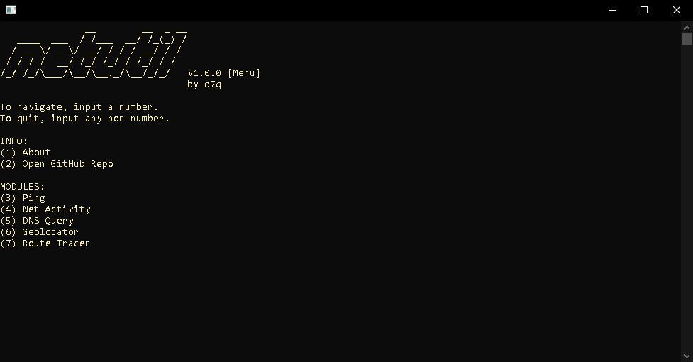

# [<b>>> Download Latest</b>](https://github.com/o7q/netutil/releases/download/v1.2.0/netutil.exe)
<h3>Welcome! netutil is a simple, command-line based, networking utility-box that executes pre-configured powershell scripts.</h3>

---

---

# Overview
netutil takes in arguments and auto-configures powershell scripts to do networking tasks.

## <b>Modules</b>
- <b>Ping</b> Ping the specified address (uses `ping`)
- <b>Net Activity</b> Displays all active connections (uses `netstat`)
- <b>DNS Query</b> Displays the bound ip to of the specified domain (uses `nslookup`)
- <b>Geolocator</b> Displays the geolocation data for the specified ip (uses `ipinfo.io`)
- <b>Route Tracer</b> Displays the path a packet takes to get to the specified address (uses `tracert`)

---

<b>netutil</b> \
Programmed with C++ and compiled using MinGW G++